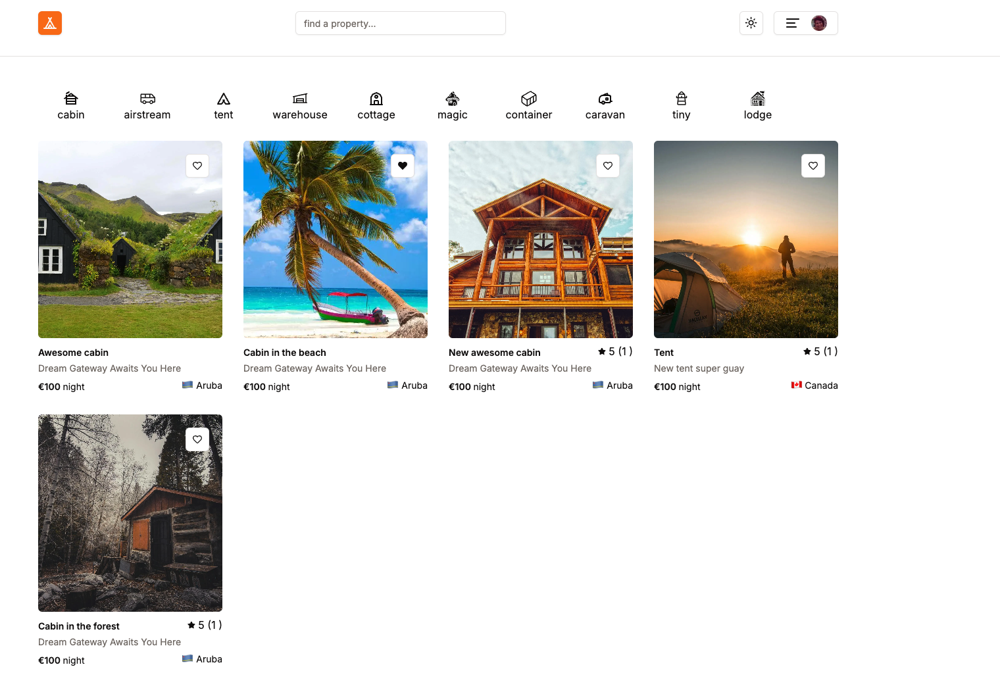
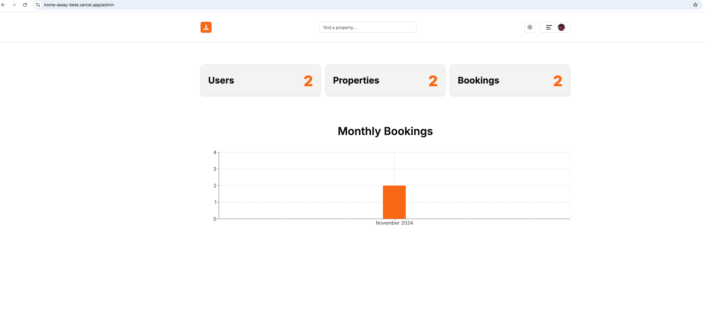

# Home Away

Home Away is a clone from airbnb where you can add, delete some properties and books other
properties active in the app. You can also leave a review if you are not the owner of the property
or select your favorites.

This repository contains the source code for the application, built with modern frontend
technologies to deliver a user-friendly and responsive experience.

You can see the project in production in this url: [Home Away](https://home-away.vercel.app/)

## Running the project

[Github repo](https://github.com/gemaderus/home-away).

To run the project locally, you need to clone the repository and install the dependencies.

```bash
git clone git@github.com:gemaderus/home-away.git
cd home-away
npm install
```

## Design

### Home page



### Admin section



### Reservations page


### Payment page


To check the payment you can use the following card number: 4242 4242 4242 4242 with any future date
and any 3 digits for the CVC.

## Technologies used

- [Next.js](https://nextjs.org/)
- [React](https://reactjs.org/)
- [TypeScript](https://www.typescriptlang.org/)
- [Supabase](https://supabase.com/): database.
- [Prisma](https://www.prisma.io/): to interact with the database.
- [Clerk](https://clerk.com/): for authentication.
- [Shadcn](https://ui.shadcn.com/), [RadixUI](https://www.radix-ui.com/),
  [react-date-picker](https://daypicker.dev/): UI components.
- [React-leaflet](https://react-leaflet.js.org/): to show the home localization.
- [TailwindCSS](https://tailwindcss.com/): for styling.
- [Zod](https://zod.dev/): schema for validations.
- [Zustand](https://zustand.docs.pmnd.rs/getting-started/introduction): to handle the state.
- [Stripe](https://stripe.com/en-es): for payments.
- [Vercel](https://vercel.com/): for deployment.

## Features

- Add and delete your properties.
- See your properties.
- Book some properties.
- Select your favorites.
- Leave a review if you are not the owner. Delete your comments.
- There is an admin view for the admin role.
